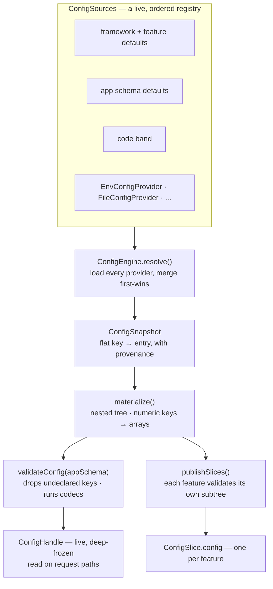
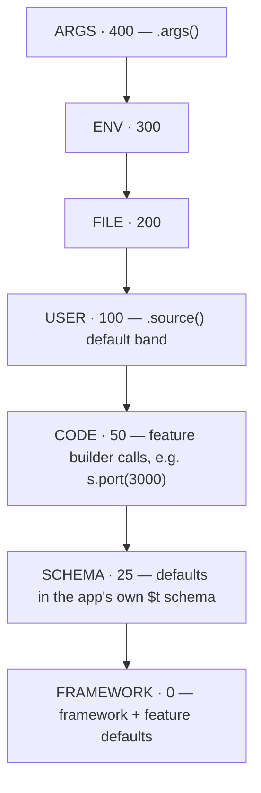
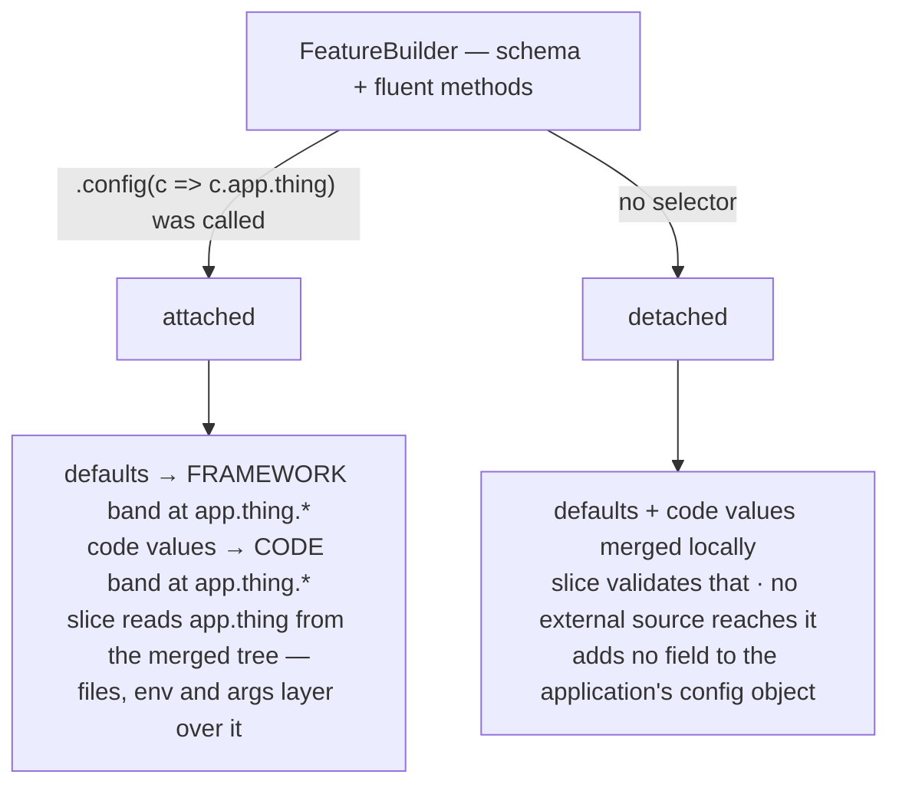
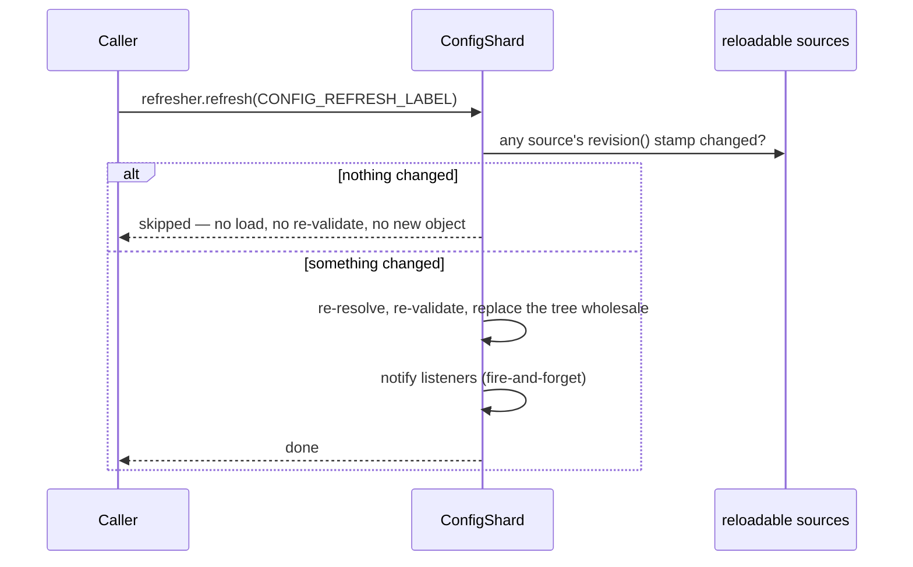
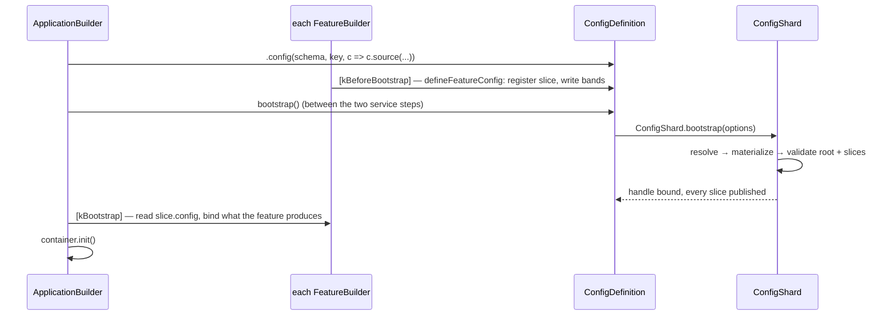

# `@caffeinejs/std/config`

The configuration subsystem behind a Caffeine application: a layered, schema-validated,
live-refreshable configuration tree that a feature reads its own slice of without ever seeing the
whole.

One rule runs through all of it — **the binary carries defaults, the deployment overrides them.** A
value set in code is a default; a file, an environment variable or a command-line argument wins over
it. That is what lets one image ship with sensible values and still be redirected on deploy.

```ts
import type { ConfigHandle, ConfigProvider } from '@caffeinejs/std/config'
import { EnvConfigProvider } from '@caffeinejs/std/config'
```

The package entry point is [`config.ts`](./config.ts) — the core type vocabulary — re-exported
alongside the runtime pieces from [`index.ts`](./index.ts).

---

## The mental model

Every provider produces flat dotted keys (`server.port`). The engine merges them, the result is
materialized into a tree, and that tree is validated twice: once against the application's own schema
for the root handle, and once per feature against the feature's own schema for its slice.



The merge is **first-wins**: the highest-priority source that names a path owns that path and
everything beneath it. No lower source contributes part of something a higher source already spoke
about — which is why an array is _replaced_, never element-merged.

Feature slices read from the **materialized** tree, not the root-validated one: root validation drops
keys the application's schema does not declare, and a feature namespace the application never
described would be stripped before the feature ever saw it.

---

## The priority chain



Top wins. Registration order breaks ties **within** a band.

`ConfigPriority` is the exported constant. A source added with `.source(provider)` lands in `USER`.
The `FILE` / `ENV` / `ARGS` bands are for an application that layers several sources and needs a file
to lose to an environment variable regardless of the order they were registered — pass the band
explicitly:

```ts
.config(schema, kConfig, c => c
  .source(new JSONConfigProvider('./config/app.json'), ConfigPriority.FILE)
  .source(new EnvConfigProvider({ prefix: 'APP_' }), ConfigPriority.ENV))
```

---

## Declaring the application configuration

`.config(schema, key, configure?)` on the application builder does three things: sets the schema the
root tree is validated against, names the DI token the resolved [`ConfigHandle`](./config.ts) is
bound under, and opens a builder for registering sources.

```ts
// config.ts — schema and key together, so container.get(kAppConfig) needs no type argument
export const appConfigSchema = $t.Object({
  server: $t.Object({ host: $t.String({ default: '0.0.0.0' }), port: $t.Number({ default: 9999 }) }, { default: {} }),
})
export type AppConfig = InferSchema<typeof appConfigSchema>
export const kAppConfig = token<ConfigHandle<AppConfig>>(Symbol('petstore.config'))

// app.ts
createWebApplication()
  .config(appConfigSchema, kAppConfig, c => c.source(new EnvConfigProvider({ prefix: 'PETSTORE_' })))
  .server(s => s.config(c => c.server)) // splice the server feature into c.server
```

The schema is either the **`$t` dialect** (TypeBox — the first-class choice, introspected for
defaults and `$t.Secret` marks) or any [Standard Schema](https://standardschema.dev) — zod v4,
valibot, arktype. A foreign schema is validated by its own library, transforms and all, but exposes
nothing to walk: its defaults reach only the root tree, and a secret declared in one is not marked.

An application that declares nothing still resolves — the root validates against a pass-through schema
and every feature still reads its slice.

---

## How a feature gets its configuration

A `FeatureBuilder` subclass is a fluent surface over exactly one slice. It names its shape with
`schema`, writes into the `CODE` band from its methods with `set`, and binds in `bootstrap`.
Everything between — resolving where the settings live, writing the bands, registering the slice — is
handled by the base class.



Where the settings live is the **application's** choice, named with the `.config(selector)` the
application passes — `s.config(c => c.server)`. A feature is never placed somewhere the application
did not ask for. Without a selector the slice resolves detached: it works, it just has no external
overrides.

Two helpers cover what `set` cannot express:

- **`derive(compute, key?)`** — fold the raw settings into the shape the feature runs on (and merge
  back a dispatcher or handler that cannot travel through a tree). Recomputed on every refresh.
- **`splitOptionBag(options)`** — split a third-party option bag into the data half that goes in the
  slice and the callbacks that stay on the builder.

---

## Reading configuration

| From                      | How                                                                 | Notes                                                        |
| ------------------------- | ------------------------------------------------------------------- | ------------------------------------------------------------ |
| The application's own key | `container.get(kAppConfig)`                                         | Typed `ConfigHandle<AppConfig>`, live                        |
| Any feature's settings    | `container.get(Configuration).config(kServerConfig)`                | By `FeatureConfigKey`, `undefined` if not installed          |
| Value injection           | `$i.value(c => c.database.host)`                                    | The handle is bound under the values key; follows refresh    |
| Inside a feature          | `this.slice.config`                                                 | Stable identity, fields follow every refresh                 |
| Resolve metadata          | `container.get(Configuration)`                                      | `.snapshot()`, `.revision`, `.diagnostics`, `.onChange(...)` |
| Escape hatch              | `configuration.env('DATABASE_URL')` / `.either(c => c.x, fallback)` | Straight from `process.env`, or a safe deep read             |

A `FeatureConfigKey` is minted with `featureConfigKey<T>('name')` and published either by a builder's
`configKey` field or by `derive(fn, key)`. It is addressed by identity, so a feature that relocated
its settings is still found.

`Configuration.snapshotHandle` is a handle fixed to one revision — what a request-scoped read latches
onto, so a refresh landing mid-request cannot change the answers a request already started with.

---

## Providers

| Provider                    | Reads from                                     | Notes                                                                                                      |
| --------------------------- | ---------------------------------------------- | ---------------------------------------------------------------------------------------------------------- |
| `EnvConfigProvider`         | `process.env` (or an injected accessor)        | `HEALTH__DRAIN_DELAY` → `health.drainDelay`; `__` splits segments, `_` within a segment folds to camelCase |
| `ArgsConfigProvider`        | `process.argv`                                 | `--server.port=8080`, `--no-x`, short-switch mappings; opt-in via `.args()`                                |
| `FileConfigProvider`        | one file + profile siblings                    | Takes a parser function — `std` ships only JSON                                                            |
| `JSONConfigProvider`        | a `.json` file                                 | `FileConfigProvider` with `JSON.parse`                                                                     |
| `InlineConfigProvider`      | a fixed object                                 | Test fixtures, embedded defaults                                                                           |
| `MutableConfigProvider`     | an in-memory object written after registration | `reloadable`; backs the framework's own bands                                                              |
| `SpringCloudConfigProvider` | a remote configuration server                  | `reloadable`; re-fetched on every refresh                                                                  |

A YAML or TOML file is read by handing `FileConfigProvider` the parse function from whatever library
the application already depends on:

```ts
new FileConfigProvider('./config/app.yaml', text => YAML.parse(text))
```

Text values coerce identically across `EnvConfigProvider` and `ArgsConfigProvider`, so moving a
setting between the environment and the command line cannot change its type.

Writing a custom provider is implementing [`ConfigProvider`](./config.ts): an `id`, a `load(ctx)` that
returns `PropertySource[]`, and optionally `reloadable` + `revision()` for cheap refresh.

---

## Profiles

An active profile (`dev`, `eu`, `canary`) selects overlay files and can be set from any source. The
list lives at `caffeine.profiles`, and discovery is **two-phase**: resolution runs once with no
profile to read that key, then again profile-aware if one was named.

```text
./config/app.json          base
./config/app-eu.json       loaded when 'eu' is active, overrides the base
./config/app-canary.json   loaded when 'canary' is active, overrides both
```

The cost is one extra full resolve per bootstrap for an application that names a profile; one that
names none pays nothing. `activeProfiles(raw)` normalizes the value — a duplicate or a blank is
harmless.

---

## Live refresh



A source is refreshable only if it says so — `reloadable` is opt-in, because one source wrongly
claiming it can change defeats the optimization for the whole application. A `revision()` stamp that
matches last time skips the resolve entirely.

`onChange` delivery is **latest-wins**: a listener never runs concurrently with itself, at most one
delivery is pending per listener, and a throw is reported through the warning channel rather than
escaping. It is not called at start-up, nor when a refresh produced the same values. Reading a field
through the handle already follows every refresh — `onChange` is for a listener that has to _act_
(resize a pool, reopen a connection).

The shard is bound under `Scopes.REFRESH` with the `CONFIG_REFRESH_LABEL` label.

---

## Secrets and diagnostics

Mark a field `$t.Secret(...)` and the diagnostics redact it — `valueAt`, and the whole `snapshot`,
which is the one thing here built to be dumped to a log. A feature's own read path does **not** go
through redaction: it reads the real value through its slice.

```ts
container.get(Configuration).diagnostics.originOf('database.host') // → 'env:DATABASE_HOST'
container.get(Configuration).diagnostics.valueAt('database.password') // → '[redacted]'
```

Only the `$t` dialect is introspected for `$t.Secret` — worth knowing before reaching for zod to
describe a slice that holds credentials.

---

## Where it sits in application bootstrap



`ConfigDefinition` is the mutable description the application builder owns and every feature
contributes to. It is resolved once, after every feature has declared and before any reads its
settings — a slice that cannot resolve fails start-up here, which is more legible than failing at
whatever moment the feature was first used. `ConfigModule` binds what the resolved shard holds.

---

## Core types

All in [`config.ts`](./config.ts):

| Type                                                                      | Role                                                                                 |
| ------------------------------------------------------------------------- | ------------------------------------------------------------------------------------ |
| `ConfigValue`, `ConfigPrimitive`, `ConfigEntry`                           | The value shapes flowing through a resolve                                           |
| `ConfigProvider`, `PropertySource`, `ResolutionContext`, `ConfigSnapshot` | The provider contract and what it produces                                           |
| `ConfigSchema`, `InferConfig`                                             | A schema: `$t` or any Standard Schema                                                |
| `ConfigHandle`, `ConfigAccessors`, `ConfigLocation`                       | The read-only projections — root handle, nested node, `.config(...)` selector target |
| `FeatureConfigKey`                                                        | A symbol branded with the configuration it addresses                                 |
| `ConfigChangeListener`                                                    | An `onChange` listener                                                               |
| `ConfigDiagnostics`, `ConfigSliceFailure`                                 | Provenance, redaction, per-feature resolve failures                                  |

Runtime pieces exported from [`index.ts`](./index.ts): `ConfigSlice`, `ConfigSources`,
`ConfigPriority`, `ConfigDefinition`, `ConfigModule`, `Configuration`, `featureConfigKey`,
`defineFeatureConfig`, `configEquals`, `splitOptionBag`, `activeProfiles`, the seven providers, and
the `ErrConfig*` classes.

---

## Package layout

| Area                | Files                                                                      |
| ------------------- | -------------------------------------------------------------------------- |
| Vocabulary          | `config.ts`                                                                |
| Merge engine        | `engine.ts`, `sources.ts`, `flatten.ts`, `materializer.ts`, `path.ts`      |
| Schema + validation | `schema.ts`, `secrets.ts`, `errors.ts`                                     |
| Feature slices      | `slice.ts`, `feature.ts`, `feature_key.ts`, `definition.ts`, `accessor.ts` |
| Resolve + refresh   | `bootstrap.ts`, `notifier.ts`, `diagnostics.ts`, `profiles.ts`             |
| DI integration      | `integration/shard.ts`, `integration/module.ts`, `configuration.ts`        |
| Providers           | `providers/`                                                               |
| Authoring helpers   | `option_bag.ts`, `selector_path.ts`                                        |
