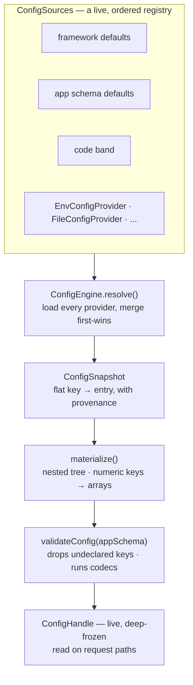
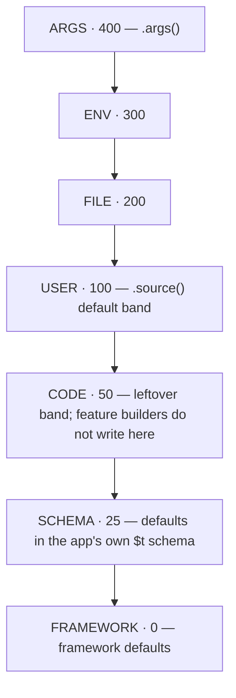
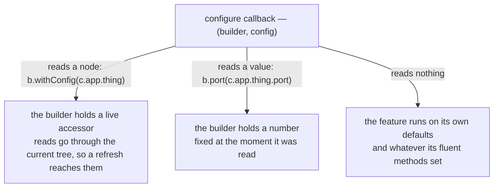
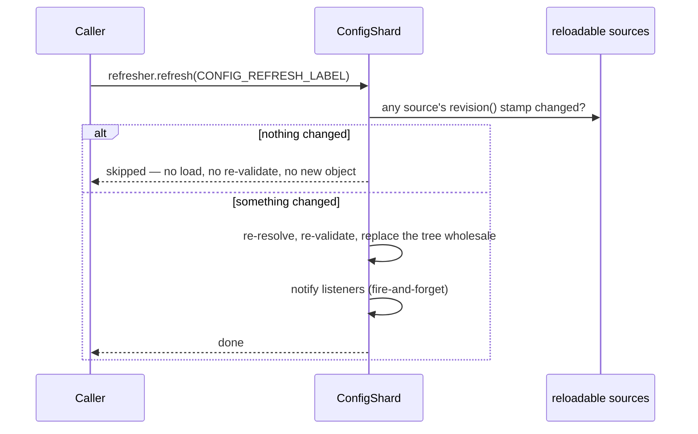
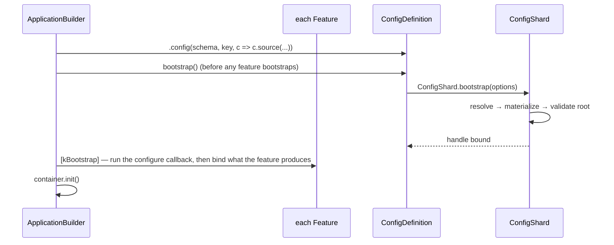

# `@caffeinejs/std/config`

The configuration subsystem behind a Caffeine application: a layered, schema-validated,
live-refreshable configuration tree that the application schema describes and a feature reads from
only where the configure callback wired it.

One rule runs through all of it — **a fluent method is the last word.** Configuration reaches a
feature because the application's callback wired it (`withConfig`). A value set in code is not a
default that file, env or args quietly outrank. Kafka, view, messaging, and authentication scheme
secrets are the named exceptions (see CONVENTIONS.md).

```ts
import type { ConfigHandle, ConfigProvider } from '@caffeinejs/std/config'
import { EnvConfigProvider } from '@caffeinejs/std/config'
```

The package entry point is [`config.ts`](./config.ts) — the core type vocabulary — re-exported
alongside the runtime pieces from [`index.ts`](./index.ts).

---

## The mental model

Every provider produces flat dotted keys (`server.port`). The engine merges them, the result is
materialized into a tree, and that tree is validated against the application's own schema.



The merge is **first-wins**: the highest-priority source that names a path owns that path and
everything beneath it. No lower source contributes part of something a higher source already spoke
about — which is why an array is _replaced_, never element-merged.

Keys the application's schema does not declare are dropped at root validation. A feature reads only
what the configure callback handed it from that tree.

---

## The priority chain



Top wins. Registration order breaks ties **within** a band.

`ConfigPriority` is the exported constant. A source added with `.source(provider)` lands in `USER`.
The `FILE` / `ENV` / `ARGS` bands are for an application that layers several sources and needs a file
to lose to an environment variable regardless of the order they were registered — pass the band
explicitly:

```ts
.config(schema, kConfig, c => c
  .source(new JSONConfigProvider('./config/app.json'), ConfigPriority.FILE)
  .source(new EnvConfigProvider({ prefix: 'APP_' }), ConfigPriority.ENV))
```

---

## Declaring the application configuration

`.config(schema, key, configure?)` on the application builder does three things: sets the schema the
root tree is validated against, names the DI token the resolved [`ConfigHandle`](./config.ts) is
bound under, and opens a builder for registering sources.

```ts
// config.ts — schema and key together, so container.get(kAppConfig) needs no type argument
export const appConfigSchema = $t.Object({
  server: $t.Object({ host: $t.String({ default: '0.0.0.0' }), port: $t.Number({ default: 9999 }) }, { default: {} }),
})
export type AppConfig = InferSchema<typeof appConfigSchema>
export const kAppConfig = token<ConfigHandle<AppConfig>>(Symbol('petstore.config'))

// app.ts
createWebApplication()
  .config(appConfigSchema, kAppConfig, c => c.source(new EnvConfigProvider({ prefix: 'PETSTORE_' })))
  .server((s, c) => s.withConfig(c.server))
```

The schema is either the **`$t` dialect** (TypeBox — the first-class choice, introspected for
defaults and `$t.Secret` marks) or any [Standard Schema](https://standardschema.dev) — zod v4,
valibot, arktype. A foreign schema is validated by its own library, transforms and all, but exposes
nothing to walk: its defaults reach only the root tree, and a secret declared in one is not marked.

An application that declares nothing still resolves — the root validates against a pass-through schema.

---

## How a feature gets its configuration

A feature registers nothing here. The application reads the tree and hands the feature what it wants,
in the configure callback `.extend(...)` takes:

```ts
.extend(server((s, c) => s.withConfig(c.app.server)))
.extend(kafka((k, c) => k.brokers(c.app.kafka.brokers)))
```



Three things follow from that:

- **A fluent method is the last word.** `s.port(3000)` is not a default the environment outranks. Where
  both are named, the more specific wins: a setter beats the block `withConfig` handed over.
- **Liveness is the author's choice.** A node read through follows a refresh; a scalar copied out of one
  does not. A feature whose readers need a _folded_ shape to stay live builds it with `liveFold(...)` —
  a stable identity whose fields refold only when the settings behind them actually changed.
- **The application's schema is the only schema.** A feature seeds nothing, so a block declared with
  required, undefaulted fields and no source to fill them fails validation. Splice the feature's exported
  schema (`serverConfigSchema`, `healthConfigSchema`, …) rather than restating the fields — importing it is
  what carries the feature's defaults into the tree.

The callback runs once, when the application bootstraps: after configuration has resolved, and before the
feature binds anything. An authoring mistake inside it therefore surfaces from `ready()`, not from the
`.extend(...)` call that wrote it.

---

## Reading configuration

| From                      | How                                                                 | Notes                                                        |
| ------------------------- | ------------------------------------------------------------------- | ------------------------------------------------------------ |
| The application's own key | `container.get(kAppConfig)`                                         | Typed `ConfigHandle<AppConfig>`, live                        |
| Any feature's settings    | `container.getOptional(kServerOptions)`                             | A binding the feature made, absent if not installed          |
| Value injection           | `$i.value(c => c.database.host)`                                    | The handle is bound under the values key; follows refresh    |
| Inside a feature          | whatever the configure callback handed it                           | A node stays live; a value copied out of one does not        |
| Resolve metadata          | `container.get(Configuration)`                                      | `.snapshot()`, `.revision`, `.diagnostics`, `.onChange(...)` |
| Escape hatch              | `configuration.env('DATABASE_URL')` / `.either(c => c.x, fallback)` | Straight from `process.env`, or a safe deep read             |

There is no feature-key registry and no callable config handle: a feature that wants its resolved options
readable from outside binds them, exactly as `ShutdownBuilder` binds `kShutdownPolicy`.

`Configuration.snapshotHandle` is a handle fixed to one revision — what a request-scoped read latches
onto, so a refresh landing mid-request cannot change the answers a request already started with.

---

## Providers

| Provider                    | Reads from                                     | Notes                                                                                                      |
| --------------------------- | ---------------------------------------------- | ---------------------------------------------------------------------------------------------------------- |
| `EnvConfigProvider`         | `process.env` (or an injected accessor)        | `HEALTH__DRAIN_DELAY` → `health.drainDelay`; `__` splits segments, `_` within a segment folds to camelCase |
| `ArgsConfigProvider`        | `process.argv`                                 | `--server.port=8080`, `--no-x`, short-switch mappings; opt-in via `.args()`                                |
| `FileConfigProvider`        | one file + profile siblings                    | Takes a parser function — `std` ships only JSON                                                            |
| `JSONConfigProvider`        | a `.json` file                                 | `FileConfigProvider` with `JSON.parse`                                                                     |
| `InlineConfigProvider`      | a fixed object                                 | Test fixtures, embedded defaults                                                                           |
| `MutableConfigProvider`     | an in-memory object written after registration | `reloadable`; backs the framework's own bands                                                              |
| `SpringCloudConfigProvider` | a remote configuration server                  | `reloadable`; re-fetched on every refresh                                                                  |

A YAML or TOML file is read by handing `FileConfigProvider` the parse function from whatever library
the application already depends on:

```ts
new FileConfigProvider('./config/app.yaml', text => YAML.parse(text))
```

Text values coerce identically across `EnvConfigProvider` and `ArgsConfigProvider`, so moving a
setting between the environment and the command line cannot change its type.

Writing a custom provider is implementing [`ConfigProvider`](./config.ts): an `id`, a `load(ctx)` that
returns `PropertySource[]`, and optionally `reloadable` + `revision()` for cheap refresh.

---

## Profiles

An active profile (`dev`, `eu`, `canary`) selects overlay config files:

```text
./config/app.json          base
./config/app-eu.json       loaded when 'eu' is active, overrides the base
./config/app-canary.json   loaded when 'canary' is active, overrides both
```

Which profiles are active is settled **before anything resolves** — a value that only exists after a
resolve cannot decide what that resolve reads. Three sources name them, and they union:

| Source                                                    | Read by                                        |
| --------------------------------------------------------- | ---------------------------------------------- |
| The container — `new CaffeineIoC({ profiles: ['test'] })` | the application, off `container.profiles`      |
| Command line — `--caffeine.profiles=eu,dev`               | `hostProfiles()`, straight from `process.argv` |
| Environment — `CAFFEINE__PROFILES=eu,dev`                 | `hostProfiles()`, straight from `process.env`  |

`hostProfiles()` reads the host directly: no provider, no merge, no resolve. An argument beats an
environment variable, and both go through `activeProfiles(raw)`, so `eu,dev` splits and a duplicate
or a blank is harmless.

**If none of the three named a profile — and only then — the base config file speaks for itself:**
`FileConfigProvider` reads `caffeine.profiles` out of the base object it already parses and picks its
own overlays. Only the base, never an overlay; an overlay deciding which overlays to load would be
the second resolve this design exists to remove.

Setting `caffeine.profiles` anywhere else — an inline source, a config server — selects nothing. The
value still reaches the tree, but by the time it exists every file has already been read.

> Name the profiles in one place. If something named a profile up front _and_ a base file also sets
> `caffeine.profiles`, the up-front set wins everywhere it matters — overlays, `@Profile` beans,
> `app.profiles` — but the resolved `caffeine.profiles` field still shows the file's literal value.

The whole application resolves **once** at start-up and once per refresh, whether or not a profile is
active.

---

## Live refresh



A source is refreshable only if it says so — `reloadable` is opt-in, because one source wrongly
claiming it can change defeats the optimization for the whole application. A `revision()` stamp that
matches last time skips the resolve entirely.

`onChange` delivery is **latest-wins**: a listener never runs concurrently with itself, at most one
delivery is pending per listener, and a throw is reported through the warning channel rather than
escaping. It is not called at start-up, nor when a refresh produced the same values. Reading a field
through the handle already follows every refresh — `onChange` is for a listener that has to _act_
(resize a pool, reopen a connection).

The shard is bound under `Scopes.REFRESH` with the `CONFIG_REFRESH_LABEL` label.

---

## Secrets and diagnostics

Mark a field `$t.Secret(...)` and the diagnostics redact it — `valueAt`, and the whole `snapshot`,
which is the one thing here built to be dumped to a log. A feature's own read path does **not** go
through redaction: it reads the real value the callback handed it.

```ts
container.get(Configuration).diagnostics.originOf('database.host') // → 'env:DATABASE_HOST'
container.get(Configuration).diagnostics.valueAt('database.password') // → '[redacted]'
```

Only the `$t` dialect is introspected for `$t.Secret` — worth knowing before reaching for zod to
describe a slice that holds credentials.

---

## Where it sits in application bootstrap



`ConfigDefinition` is the mutable description the application builder owns. It is resolved once, before
any feature bootstraps and while binding is still open — which is what lets a feature be configured from a
setting it then consumes at binding time. A tree that cannot validate fails start-up here, which is more
legible than failing at whatever moment something first read it. `ConfigModule` binds what the resolved
shard holds.

---

## Core types

All in [`config.ts`](./config.ts):

| Type                                                                      | Role                                                 |
| ------------------------------------------------------------------------- | ---------------------------------------------------- |
| `ConfigValue`, `ConfigPrimitive`, `ConfigEntry`                           | The value shapes flowing through a resolve           |
| `ConfigProvider`, `PropertySource`, `ResolutionContext`, `ConfigSnapshot` | The provider contract and what it produces           |
| `ConfigSchema`, `InferConfig`                                             | A schema: `$t` or any Standard Schema                |
| `ConfigHandle`, `ConfigAccessors`, `ConfigLocation`                       | The read-only projections — root handle, nested node |
| `ConfigChangeListener`                                                    | An `onChange` listener                               |
| `ConfigDiagnostics`, `ConfigSliceFailure`                                 | Provenance, redaction, per-feature resolve failures  |

Runtime pieces exported from [`index.ts`](./index.ts): `ConfigSlice`, `ConfigSources`,
`ConfigPriority`, `ConfigDefinition`, `ConfigModule`, `Configuration`, `liveFold`,
`configEquals`, `activeProfiles`, `hostProfiles`, the seven providers, and
the `ErrConfig*` classes.

---

## Package layout

| Area                | Files                                                                 |
| ------------------- | --------------------------------------------------------------------- |
| Vocabulary          | `config.ts`                                                           |
| Merge engine        | `engine.ts`, `sources.ts`, `flatten.ts`, `materializer.ts`, `path.ts` |
| Schema + validation | `schema.ts`, `secrets.ts`, `errors.ts`                                |
| Definition          | `definition.ts`, `accessor.ts`, `slice.ts`                            |
| Resolve + refresh   | `bootstrap.ts`, `notifier.ts`, `diagnostics.ts`, `profiles.ts`        |
| DI integration      | `integration/shard.ts`, `integration/module.ts`, `configuration.ts`   |
| Providers           | `providers/`                                                          |
| Authoring helpers   | `selector_path.ts`                                                    |
