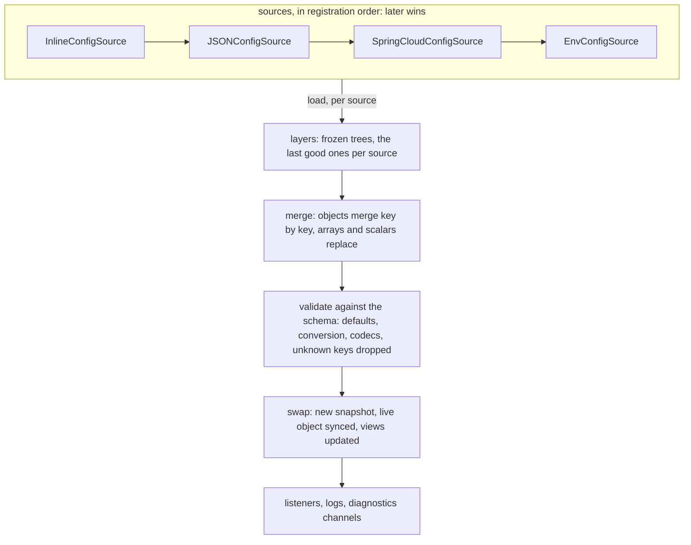
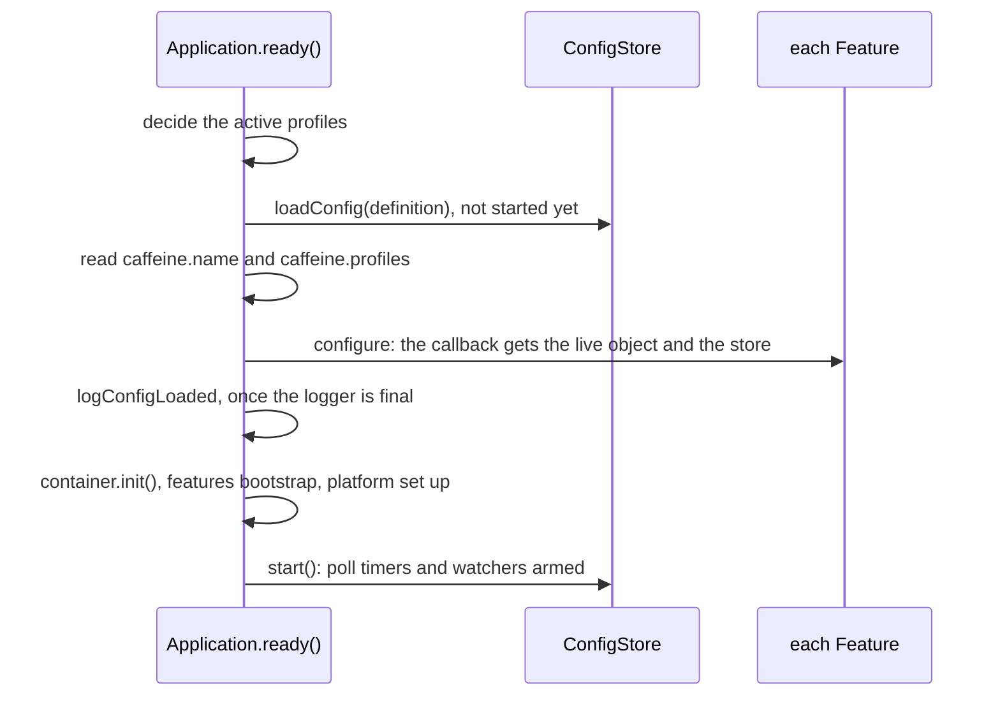

# `@caffeinejs/std/config`

The configuration of a Caffeine application: a tree built from ordered sources, validated against the
application's own schema, and read as a plain object. A live source can change part of the tree while the process
runs, and every reader of the configuration sees the new values without asking.

```ts
import { EnvConfigSource, type InferConfig } from '@caffeinejs/std/config'
```

One rule runs through all of it: **a fluent method is the last word.** Configuration reaches a feature because the
application's configure callback wired it (`config(...)`). A value set in code is not a default that a file, the
environment or an argument quietly outranks. Kafka, messaging and authentication scheme secrets are the named
exceptions (see `CONVENTIONS.md`).

---

## The pieces

| Name                  | What it is                                                                                 |
| --------------------- | ------------------------------------------------------------------------------------------ |
| `ConfigSource`        | Where configuration comes from: an object with `load()`, and maybe a way to change         |
| `ConfigLayer`         | What a source contributed: a named, sparse tree                                            |
| `ConfigDefinition<T>` | What `newConfiguration(...).build()` returns: schema, keys, sources. Data only             |
| `ConfigStore<T>`      | The runtime: it loads, validates, reloads, and explains every value                        |
| `LiveConfig<T>`       | The object an application injects. One identity, and its fields follow every reload        |
| `ConfigSnapshot<T>`   | The validated tree at one revision. Frozen, and replaced rather than changed by a reload   |
| `ConfigView<V>`       | A value derived from the configuration that the store keeps current, with its own listener |

A source **loads** layers. Layers **merge** into one tree, later wins. The schema **validates** it into a
snapshot. The store **swaps** the snapshot in and keeps the live object in step. After the first load, the whole
pipeline is a **reload**.



---

## Declaring the configuration

`newConfiguration(schema, key)` names the schema the tree is validated against and the key the live config object
is bound under. The key names the application's own type, so the two must agree:

```ts
// config.ts
export const appConfigSchema = $t.Object({
  server: $t.Object({ host: $t.String({ default: '0.0.0.0' }), port: $t.Number({ default: 9999 }) }, { default: {} }),
})
export type AppConfig = InferConfig<typeof appConfigSchema>
export const kAppConfig = token<AppConfig>(Symbol('petstore.config'))

// app.ts
const conf = newConfiguration(appConfigSchema, kAppConfig)
  .source(new JSONConfigSource('./config/app.json'))
  .source(new EnvConfigSource({ prefix: 'PETSTORE_' }))
  .args()
  .build()

createWebApplication({ config: conf }).server(({ config }) => ({ listener: config.server }))
```

Precedence is registration order alone: a source added later wins a conflicting value. Here the environment
overrides the file and the command line overrides both. `.loadTimeout('10s')` bounds each load of each source; the
default is 30 seconds. A third argument, `newConfiguration(schema, key, storeKey)`, binds the typed store as well.

The schema is the `$t` dialect (TypeBox), or any [Standard Schema](https://standardschema.dev) such as zod v4,
valibot or arktype, validated by its own library. An application that declares nothing still loads: no source, and
a schema that keeps every key.

---

## Reading configuration

| Need                                                     | Use                                           | Follows a reload                             |
| -------------------------------------------------------- | --------------------------------------------- | -------------------------------------------- |
| Read settings in a service                               | Inject the application key: the live object   | Yes, always                                  |
| One revision across several `await`s, or for one request | `store.current`, or `ctx.config` in a request | No, by design                                |
| A value built from settings, or a reaction to a change   | `store.view(...)`                             | Yes: `value` is reassigned, `onChange` fires |
| One value, fixed when the consumer is built              | `$i.value(c => c.database.host)`              | Only when the consumer is rebuilt            |

The ordinary way has no wrapper:

```ts
@Injectable([kAppConfig])
class Pricing {
  constructor(private readonly config: AppConfig) {}

  quote(): number {
    return this.config.pricing.margin
  }
}
```

A singleton built once still reads the margin of the newest reload, and so does a node kept on a field. The live
object is an ordinary object whose properties are read-only data properties, not a `Proxy`: a read costs what a
plain object costs, and a write throws. `Object.keys`, `in`, spread, `JSON.stringify` and `console.log` behave as they
would on a plain object.

Three limits follow from what a live object is:

- Reads separated by an `await` can come from two revisions. Code that needs one takes `store.current` first.
- An array is a value. A kept array, or an element of one, is a snapshot; read it from a live node each time.
- A node's identity never changes, so it cannot tell you whether anything changed. Use a view, or `onChange`.

The store itself is bound under the `ConfigStore` class. It carries `current`, `revision`, `view()`, `onChange()`,
`reload()`, `explain()` and `inspect()`.

---

## Views

A view is a value the store keeps current. `select` runs once when the view is made and once per swap, never on a
read. An optional `derive` turns the selection into something that is not plain data, and runs only when the
selection changed.

```ts
const pool = store.view(c => c.database.pool)
pool.onChange(async next => db.resize(next.max)) // silent unless the pool settings changed

const allowed = store.view(
  c => c.security.allowedOrigins,
  origins => new Set(origins),
)
allowed.value.has(origin) // a property read on the request path; the Set is rebuilt only when the list changes
```

A selection deep-equal to the previous one keeps its identity, so a view is a safe memo key and a listener hears
only about its own part of the tree. The store holds a view until `close()`: make views while wiring, never per
request. A selector that throws during a swap is logged and leaves the view as it was.

---

## How a feature gets its configuration

A feature registers nothing here. The application hands it what it wants, in the configure callback:

```ts
.with(kafka((k, { config }) => k.brokers(config.app.kafka.brokers)))
.with(thing((b, { store }) => b.config(store.view(t => t.app.thing))))
.logger((b, { config }) => b.config(config.app.log))
```

- **Liveness is the author's choice.** A node handed over follows every reload; a scalar copied out of one does
  not. A feature's own resolved options are a plain object read once, when the feature configures.
- **The application's schema is the only schema.** A feature seeds nothing, so a block declared with required,
  undefaulted fields and no source to fill them fails validation. Splice the feature's exported schema
  (`loggerConfigSchema`, `healthConfigSchema`, …) rather than restating it.

The callback runs once, when the application readies: after configuration has loaded and before the feature binds
anything.

---

## Sources

| Source                    | Reads                           | Changes by                                                     |
| ------------------------- | ------------------------------- | -------------------------------------------------------------- |
| `EnvConfigSource`         | the environment                 | nothing; loaded once                                           |
| `ArgsConfigSource`        | the command line, via `.args()` | nothing; loaded once                                           |
| `FileConfigSource`        | one file and its profile files  | `{ watch: true }`: reloaded when the file or a sibling changes |
| `JSONConfigSource`        | a `.json` file                  | as `FileConfigSource`                                          |
| `InlineConfigSource`      | a fixed object                  | nothing; loaded once                                           |
| `SpringCloudConfigSource` | a Spring Cloud Config server    | `reload()`, and `pollInterval` if set                          |

`HEALTH__DRAIN_DELAY` reaches `health.drainDelay`: `__` splits segments and `_` within a segment folds to camelCase.
Without a prefix every variable of the process is read; a name that maps to no path, such as `_`, is skipped, and
so is a variable whose path another one uses as a parent, with a warning. On the command line that is an error.

`TAGS__0` and `TAGS__1` make a list: keys that are the indices 0 to n - 1 become an array, from any flat source.
Any other numeric keys stay keys, so `MESSAGES__404` beside `MESSAGES__500` makes a record.

**Values stay text.** The environment and the command line do not guess types. A `$t` schema converts: `PORT=8080`
is `8080` for a number field and `'8080'` for a string field, and `VERSION=1` stays `'1'`. A Standard Schema
converts for itself, as `z.coerce.number()` does. `$t.List` reads `TAGS=a,b` as a list and `$t.JSON` reads a whole
object from one variable.

A source's tree is taken literally. A format with no nesting of its own expands dotted keys in its parser:

```ts
new FileConfigSource('./config/app.yaml', text => YAML.parse(text))
new FileConfigSource('./config/app.ini', text => expandKeys(ini.parse(text)))
```

Layers merge per key, later winning. An array is replaced whole, so a later source can shorten or clear a list. A
key named `__proto__`, `constructor` or `prototype` is dropped and logged, never merged.

A source of your own implements `ConfigSource`: a unique `name` and `load(context)` returning layers. It declares
how it changes with `live`, `pollInterval` or `watch(changed)`, and it can be `optional`. A source that has nothing
to contribute returns no layer; a source that cannot load throws.

---

## Profiles

An active profile selects overlay files: with `eu` then `canary` active, `app.json` is read, then `app-eu.json`,
then `app-canary.json`, each overriding the one before. The profiles are decided before anything loads:

| Source                                                   | Read by                                   |
| -------------------------------------------------------- | ----------------------------------------- |
| The container: `new CaffeineIoC({ profiles: ['test'] })` | the application, off `container.profiles` |
| The command line: `--caffeine.profiles=eu,dev`           | `hostProfiles()`, from `process.argv`     |
| The environment: `CAFFEINE__PROFILES=eu,dev`             | `hostProfiles()`, from `process.env`      |

If none of the three named a profile, and only then, a file source reads `caffeine.profiles` from its own base file
and picks its overlays. Every source is loaded once, profile or not.

A profile is a name, since a file source makes a file name of it: `.`, `..` and a name holding `/` or `\` are refused
with `ERR_CONFIG_PROFILE`, wherever they were named.

---

## Live reload

| Trigger | Declared by                  | What happens                                                                             |
| ------- | ---------------------------- | ---------------------------------------------------------------------------------------- |
| Manual  | `live: true`                 | `store.reload()`, or `container.refresher.refresh(CONFIG_REFRESH_LABEL)`                 |
| Poll    | `pollInterval` on the source | Reloaded on that period, with 10 percent of jitter, backing off up to 8 times on failure |
| Watch   | `watch(changed)` on a source | Reloaded 250 ms after the changes stop                                                   |

A watcher that cannot start, because what it watches does not exist yet, is reported once and started again,
backing off from 1 s to 8 s. The source is reloaded as soon as it starts.

A reload loads only the sources its trigger names; a static source is never loaded again. Reloads never overlap:
one that arrives mid-run joins the single follow-up. Nor do a source's loads: until a load that timed out settles,
the source is not asked again, and each attempt fails at once with `ERR_CONFIG_SOURCE_TIMEOUT`. If no source's
layers changed, nothing is merged or validated.

A reload is all or nothing. When the new tree fails validation the reload is rejected: the snapshot, the live
object, the views and every source's layers stay as they were, and nobody is notified. A source that fails to load
keeps its last good layers. Either way the reason is logged, and `reload()` resolves with an outcome rather than
rejecting.

`onChange` listeners, on the store and on views, run after everything is at the new revision. A reload never waits
for them; a listener never runs concurrently with itself, a burst reaches it as the newest value, and a throw is
logged.

---

## Diagnostics

```ts
store.explain('database.host') // the value, and every layer that sets it, winner first, with its origin
store.inspect() // the revision, each source's trigger, layers and health, and the snapshot
```

Both return every value as it is, a secret included, so treat what they return as sensitive.

The store logs under `{ name: 'config' }`: the first load, every reload with the paths that changed, rejections,
failing and recovering sources, and failing listeners. Values are never logged, only paths. The issues of an
`ErrConfigValidation` from a `$t` schema name a path and what was expected there, never the value: `$t.JSON` and
`$t.List` report text they cannot read without quoting it. Two messages are not the store's own and may quote
text: a config file that does not parse, where the parser says what it stopped at, and the issues of a Standard
Schema, which its library writes.

It also publishes on `node:diagnostics_channel`, costing nothing while nobody subscribes. `load` and `reload` are
tracing channels; `change` is a plain one. The names are in `CONFIG_CHANNELS`.

---

## In application bootstrap



A tree that cannot validate fails `ready()`, which is more legible than failing wherever it was first read.

---

## Errors

| Code                          | When                                                                   |
| ----------------------------- | ---------------------------------------------------------------------- |
| `ERR_CONFIG_SOURCE`           | a source failed to load, or returned something that is not layers      |
| `ERR_CONFIG_SOURCE_TIMEOUT`   | a source did not answer within the load timeout, or still has not      |
| `ERR_CONFIG_DUPLICATE_SOURCE` | two sources share a name                                               |
| `ERR_CONFIG_KEY_CONFLICT`     | an argument or an expanded key sets a path another uses as a parent    |
| `ERR_CONFIG_FILE_PARSE`       | a file does not parse to an object                                     |
| `ERR_CONFIG_PROFILE`          | a profile is `.` or `..`, or holds `/` or `\`                          |
| `ERR_CONFIG_VALIDATION`       | the tree does not satisfy the schema (`ErrConfigValidation`, `issues`) |

---

## Package layout

| Area                  | Files                                                      |
| --------------------- | ---------------------------------------------------------- |
| Vocabulary            | `types.ts`                                                 |
| Trees                 | `tree.ts`, `merge.ts`, `reconcile.ts`, `live.ts`           |
| Runtime               | `store.ts`, `load.ts`, `triggers.ts`, `change_notifier.ts` |
| Schema                | `schema.ts`, `errors.ts`                                   |
| Diagnostics           | `explain.ts`, `observe.ts`                                 |
| Profiles              | `profiles.ts`                                              |
| Container integration | `integration/module.ts`                                    |
| Sources               | `sources/`                                                 |
