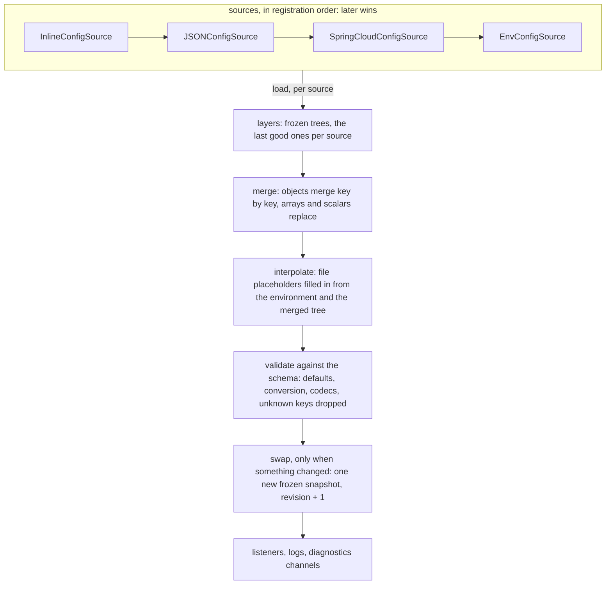
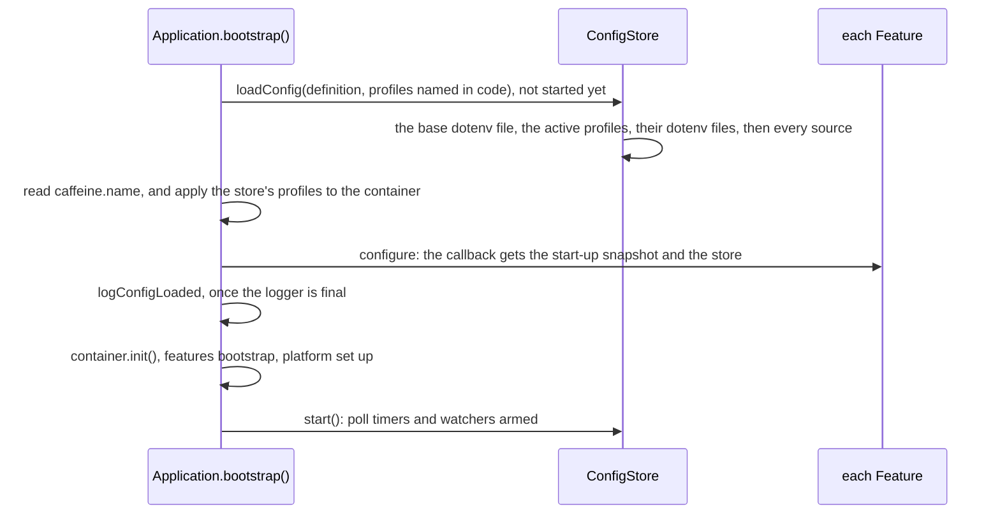

# `@caffeinejs/std/config`

The configuration of a Caffeine application: a tree built from ordered sources, validated against the
application's own schema, and read as a plain, frozen object. A live source can change part of the tree while the
process runs: the store then builds a new snapshot, and code that asked to follow reloads reads it.

```ts
import type { InferConfig } from '@caffeinejs/std/config'
import { EnvConfigSource } from '@caffeinejs/std/config/env'
```

One rule runs through all of it: **a fluent method is the last word.** Configuration reaches a feature because the
application's configure callback wired it (`config(...)`). A value set in code is not a default that a file, the
environment or an argument quietly outranks. Kafka, messaging and authentication scheme secrets are the named
exceptions (see `CONVENTIONS.md`).

---

## The pieces

| Name                  | What it is                                                                               |
| --------------------- | ---------------------------------------------------------------------------------------- |
| `ConfigSource`        | Where configuration comes from: an object with `load()`, and maybe a way to change       |
| `ConfigLayer`         | What a source contributed: a named, sparse tree                                          |
| `ConfigDefinition<T>` | What `newConfiguration(...).build().config` holds: schema, tokens, sources. Data only    |
| `ConfigStore<T>`      | The runtime: it loads, validates, reloads, and explains every value                      |
| `ConfigSnapshot<T>`   | The validated tree at one revision. Frozen, and replaced rather than changed by a reload |

A source **loads** layers. Layers **merge** into one tree, later wins, and the placeholders in file values are
**interpolated**. The schema **validates** it. When the result differs from the current snapshot, the store
**swaps** in a new frozen one; when it does not, nothing is built. After the first load, the whole pipeline is a
**reload**.


```mermaid
flowchart TB
  subgraph S["sources, in registration order: later wins"]
    direction LR
    s1["InlineConfigSource"] --> s2["JSONConfigSource"] --> s3["SpringCloudConfigSource"] --> s4["EnvConfigSource"]
  end
  S -->|"load, per source"| C["layers: frozen trees, the last good ones per source"]
  C --> M["merge: objects merge key by key, arrays and scalars replace"]
  M --> I["interpolate: file placeholders filled in from the environment and the merged tree"]
  I --> V["validate against the schema: defaults, conversion, codecs, unknown keys dropped"]
  V --> W["swap, only when something changed: one new frozen snapshot, revision + 1"]
  W --> N["listeners, logs, diagnostics channels"]
```

---

## Declaring the configuration

`newConfiguration(schema)` names the schema the tree is validated against. `build()` returns the definition the
application loads and three tokens, all typed from the schema:

```ts
// config.ts
export const appConfigSchema = $t.Object({
  server: $t.Object({ host: $t.String({ default: '0.0.0.0' }), port: $t.Number({ default: 9999 }) }, { default: {} }),
})

const conf = newConfiguration(appConfigSchema)
  .source(new JSONConfigSource('./config/app.json'))
  .source(new EnvConfigSource({ prefix: 'PETSTORE_' }))
  .argv()
  .build()

export const kConfig = conf.configToken // the configuration the application started with
export const kLiveConfig = conf.liveConfigToken // a Provider: get() answers the configuration as it is now
export const kConfigStore = conf.storeToken // the store, typed after the schema
export const config = conf.config

// app.ts
createWebApplication({ config }).server(({ config }) => ({ listener: config.server }))
```

Precedence is registration order alone: a source added later wins a conflicting value. Here the environment
overrides the file and the command line overrides both. `.loadTimeout('10s')` bounds each load of each source; the
default is 30 seconds. Every `build()` mints new tokens, so two configurations in one container never answer to each
other's.

The schema is the `$t` dialect (TypeBox), or any [Standard Schema](https://standardschema.dev) such as zod v4,
valibot or arktype, validated by its own library. An application that declares nothing still loads: no source, and
a schema that keeps every key.

---

## Reading configuration

| Need                                                | Use                                                  | Follows a reload              |
| --------------------------------------------------- | ---------------------------------------------------- | ----------------------------- |
| Read settings in a service                          | Inject `kConfig`                                     | No: start-up values           |
| One value, injected                                 | `$i.config(c => c.database.host)`                    | No: start-up values           |
| Read settings in a service that must follow reloads | Inject `kLiveConfig`, a `Provider`, and call `get()` | Yes, on every `get()`         |
| One value that must follow reloads                  | `$i.liveConfig(c => c.database.host)`, a `Provider`  | Yes, on every `get()`         |
| One revision for one request                        | `ctx.config`                                         | No: one request, one revision |
| The configuration now, outside the container        | `store.current`, `app.config`                        | Yes, on every read            |
| A reaction to a change                              | `store.onChange(listener)`                           | Yes                           |

The ordinary way has no wrapper, and reads what the application started with:

```ts
@Injectable([kConfig])
class Pricing {
  constructor(private readonly config: AppConfig) {}

  quote(): number {
    return this.config.pricing.margin
  }
}
```

A service that must see a reload takes the live token instead. The provider costs one call per read, and hands
back the frozen snapshot of the current revision:

```ts
@Injectable([kLiveConfig])
class Pricing {
  constructor(private readonly config: Provider<AppConfig>) {}

  quote(): number {
    return this.config.get().pricing.margin
  }
}
```

A snapshot is an ordinary frozen object, not a `Proxy`: a read costs what a plain object costs, and a write throws.
It never changes, so reads from one snapshot always agree with each other. Code that reads several values across an
`await` and needs them from one revision calls `get()` once and keeps the snapshot.

The store itself is bound under the `storeToken`, typed, and under the `ConfigStore` class. It carries `current`, `revision`, `onChange()`, `reload()`,
`explain()` and `inspect()`.

---

## How a feature gets its configuration

A feature registers nothing here. The application hands it what it wants, in the configure callback:

```ts
.install(Kafka((k, { config }) => k.brokers(config.app.kafka.brokers)))
.logger((b, { config }) => b.config(config.app.log))
```

- **A feature is built from the start-up snapshot.** `config` in the callback is the snapshot the application was
  configured with, and a node handed over keeps those values. A feature that must act on a reload subscribes with
  `store.onChange(...)` from the same kit.
- **The application's schema is the only schema.** A feature seeds nothing, so a block declared with required,
  undefaulted fields and no source to fill them fails validation.

The callback runs once, when the application readies: after configuration has loaded and before the feature binds
anything.

---

## Sources

| Source                    | Reads                           | Changes by                                                     |
| ------------------------- | ------------------------------- | -------------------------------------------------------------- |
| `EnvConfigSource`         | the environment                 | nothing; loaded once                                           |
| `ArgvConfigSource`        | the command line, via `.argv()` | nothing; loaded once                                           |
| `FileConfigSource`        | one file and its profile files  | `{ watch: true }`: reloaded when the file or a sibling changes |
| `JSONConfigSource`        | a `.json` file                  | as `FileConfigSource`                                          |
| `YAMLConfigSource`        | a `.yaml` file, every document  | as `FileConfigSource`                                          |
| `InlineConfigSource`      | a fixed object                  | nothing; loaded once                                           |
| `SpringCloudConfigSource` | a Spring Cloud Config server    | `reload()`, and `pollInterval` if set                          |

Each source is its own entry point, named after its folder in `sources/`:
`import { EnvConfigSource } from '@caffeinejs/std/config/env'`, and likewise `argv`, `file`, `inline`, `json`,
`spring` and `yaml`. `@caffeinejs/std/config` itself exports none of them.

`SHUTDOWN__DRAIN_DELAY` reaches `shutdown.drainDelay`: `__` splits segments and `_` within a segment folds to camelCase.
Without a prefix every variable of the process is read; a name that maps to no path, such as `_`, is skipped, and
so is a variable whose path another one uses as a parent, with a warning. On the command line that is an error.

An acronym does not survive the folding: `CACHE_TTL` reaches `cacheTtl`, never `cacheTTL`. A config file reaches
such a key by reading the variable, `TTL: '${env:CACHE_TTL}'`, and so does the command line, `--cache.TTL=5s`.

`TAGS__0` and `TAGS__1` make a list: keys that are the indices 0 to n - 1 become an array, from any flat source.
Any other numeric keys stay keys, so `MESSAGES__404` beside `MESSAGES__500` makes a record.

**Values stay text.** The environment and the command line do not guess types. A `$t` schema converts: `PORT=8080`
is `8080` for a number field and `'8080'` for a string field, and `VERSION=1` stays `'1'`. A Standard Schema
converts for itself, as `z.coerce.number()` does. `$t.List` reads `TAGS=a,b` as a list and `$t.JSON` reads a whole
object from one variable.

A source's tree is taken literally. A format with no nesting of its own expands dotted keys in its parser:

```ts
new FileConfigSource('./config/app.json5', text => JSON5.parse(text))
new FileConfigSource('./config/app.ini', text => expandKeys(ini.parse(text)))
```

`YAMLConfigSource` reads every document of a file, split by `---`, as a layer of its own, in order: a later document
wins over an earlier one, as a later source does, and `explain()` names it, `file:./config/app.yaml#2` for the
second. An empty document adds nothing, and merge keys (`<<: *defaults`) are read.

Layers merge per key, later winning. An array is replaced whole, so a later source can shorten or clear a list. A
key named `__proto__`, `constructor` or `prototype` is dropped and logged, never merged.

A source of your own implements `ConfigSource`: a unique `name` and `load(context)` returning layers. It declares
how it changes with `live`, `pollInterval` or `watch(changed)`, and it can be `optional`. A source that has nothing
to contribute returns no layer; a source that cannot load throws.

---

## Interpolation

A file's strings can take their values from the environment and from the rest of the configuration:

```yaml
app:
  name: '${env:NAME:-No Name} and ${config:team.nickname}'
db:
  url: 'postgres://${config:db.host}:${env:DB_PORT:-5432}/app'
```

| Placeholder                | Becomes                                                                         |
| -------------------------- | ------------------------------------------------------------------------------- |
| `${env:NAME}`              | the environment variable `NAME`                                                 |
| `${config:db.host}`        | the value at `db.host`; `servers[0].host` and `servers.0.host` reach into lists |
| `${env:NAME:-No Name}`     | `No Name` when `NAME` is unset or empty                                         |
| `${config:db.host:-local}` | `local` when nothing sets `db.host`, or sets it to `null` or `''`               |
| `$${`                      | a literal `${`                                                                  |

The syntax is strict: `${` always opens a placeholder. A prefix other than `env` or `config`, a key that is not a
variable name or a dotted path, an unclosed `${`, or anything but `:-` after the key fails the load with
`ERR_CONFIG_INTERPOLATION`, naming the file, the path and the character. A default runs to the first `}` and holds
no placeholder. Only a `$` right before `{` is special, and doubling it writes it: `$${env:X}` is the text
`${env:X}`, `$$${env:X}` is a `$` and the value, and `pa$$word` stays as it is. In YAML, quote a value that holds a
placeholder.

A placeholder sees what the application will see: every source, those registered after the file included, but not
the schema's defaults, which apply at validation. A value that is itself interpolated is interpolated first; a loop,
or a chain of references more than 32 deep, is an error. A placeholder that loses the merge is never looked at, so
a base file's `${env:DB_PASSWORD}` overridden by `app-dev.yaml` needs no `DB_PASSWORD`. What a placeholder brings
in is text, taken as it is: it is never interpolated again, and a `$t` schema converts it as it converts the
environment. A number or a boolean it reads becomes text; an object or a list is an error.

A variable that is unset, or a path nothing sets, with no default fails the load, or rejects a reload, with an
`ErrConfigValidation` whose issues name each value. File sources interpolate, and `{ interpolate: false }` reads
them as written; the environment's own values never are. A source of your own opts in with `interpolate: true` on its
layers. Dotenv files expand their own `${env:NAME}` references as they load, before any source: see
[Dotenv files](#dotenv-files).

A file that interpolates can read every environment variable, so whoever can edit it can read the environment. A
value built from a secret is a secret, and so is one another source can steer: in
`https://${config:tenant}.hooks.example.com/?key=${env:HOOK_KEY}`, whoever sets `tenant` decides where the key
goes. A default is text in the file, never a secret.

---

## Profiles

An active profile selects overlay files: with `eu` then `canary` active, `app.json` is read, then `app-eu.json`,
then `app-canary.json`, each overriding the one before. The profiles are decided before any source loads, and nothing
else names them:

| Source                                                     | Read by                                   |
| ---------------------------------------------------------- | ----------------------------------------- |
| The container: `new CaffeineIoC({ profiles: ['test'] })`   | the application, off `container.profiles` |
| The application: `createApplication({ profiles: ['eu'] })` | the application, off its options          |
| The command line: `--caffeine.profiles=eu,dev`             | `hostProfiles()`, from `process.argv`     |
| The environment: `CAFFEINE_PROFILES=eu,dev`                | `hostProfiles()`, from `process.env`      |

They add up in that order, except that the command line, when given, replaces the environment. A profile named twice
keeps its first place, and every source is loaded once, with the list. A `caffeine.profiles` in a file, a variable or
any other source is an ordinary key: nothing reads it.

`CAFFEINE_PROFILES` may also come from the base dotenv file, which loads before the profiles are read; one the
environment already holds wins over it. See [Dotenv files](#dotenv-files).

A profile is a name, since a file source makes a file name of it: `.`, `..` and a name holding `/` or `\` are refused
with `ERR_CONFIG_PROFILE`, wherever they were named.

---

## Dotenv files

A configuration can load dotenv files into `process.env` before any source loads. It brings no parser of its own:
the application hands it a loader, and `@caffeinejs/std/config/nodejs` has one built on `process.loadEnvFile`:

```ts
import { newConfiguration } from '@caffeinejs/std'
import { EnvConfigSource } from '@caffeinejs/std/config/env'
import { loadEnvFiles } from '@caffeinejs/std/config/nodejs'

newConfiguration(ConfigSchema)
  .dotEnv({ loader: loadEnvFiles, path: './config' })
  .source(new EnvConfigSource({ prefix: 'PETSTORE_' }))
  .build()
```

The base file loads first, `config/.env` unless `baseName` names another, and it may name the profiles:
`CAFFEINE_PROFILES=dev` there counts as if the environment held it, so `--caffeine.profiles`, or a `CAFFEINE_PROFILES`
the environment already holds, still wins. Once a profile is active, what the base set is taken back and the loader is
called again with every file, the most specific first: with `dev` then `prod` active, `config/.env.prod`,
`config/.env.dev`, then `config/.env`. Only the base names profiles: a `CAFFEINE_PROFILES` in a profile's file is not
read.

The first file to set a variable wins, and a variable already set wins over every file, so a profile's file overrides
the base and the environment the application was started with keeps the last word. `process.loadEnvFile` and dotenv
both work this way when handed the list as it is:

```ts
const loader: DotenvLoader = files => {
  dotenv.config({ path: files, quiet: true })
}
```

A loader that overrides lets a file outrank the environment the application was started with. A file that is not
there is the loader's to skip: `loadEnvFiles` skips it, and fails on one that is there and cannot be read. A loader
that throws fails the load with `ERR_CONFIG_DOTENV`, before any source loads.

What the files set is expanded once every file has loaded, before any source, so an entry may read another from any
of the files:

```sh
PORT=3000
GREETING=${env:PORT} Hi
```

`${env:NAME}` reads an entry the files set, itself expanded first, or else the variable the environment holds, taken
as it is: the value the process ends up with either way, so an entry the environment overrides reads as the
environment's. `${env:NAME:-text}` falls back to `text` when the variable is unset or empty, and `$${` is a literal
`${`. `${config:path}` is refused: no source has loaded yet. A malformed placeholder, a variable unset with no default,
or references that loop fail the load with `ERR_CONFIG_INTERPOLATION`, naming the variable and never its value.
`CAFFEINE_PROFILES` is expanded as soon as the base file has loaded, since it names the profiles: it can read the base
file and the environment, not the file of a profile.

The expanded text is what `process.env` holds from then on, for every reader: the sources, the features, child
processes. An environment source reads it as any other variable, and never interpolates it again; one reading an
`env` of its own sees none of it. A loader that expands values itself reads a placeholder its own way, so it goes with
`.dotEnv({ loader, path, interpolate: false })`, which leaves the files' text as they wrote it.

A dotenv file is as trusted as the code. Whoever can write it sets any variable the process reads from then on, the
runtime's own among them: `NODE_TLS_REJECT_UNAUTHORIZED=0` turns off certificate checks, and `NODE_ENV=test` turns
off the framework's signal handling. A loader that runs commands runs what the file says. Keep the files out of
version control and out of images.

---

## Live reload

| Trigger | Declared by                  | What happens                                                                             |
| ------- | ---------------------------- | ---------------------------------------------------------------------------------------- |
| Manual  | `live: true`                 | `store.reload()`, or `container.refresher.refresh(CONFIG_REFRESH_LABEL)`                 |
| Poll    | `pollInterval` on the source | Reloaded on that period, with 10 percent of jitter, backing off up to 8 times on failure |
| Watch   | `watch(changed)` on a source | Reloaded 250 ms after the changes stop                                                   |

A watcher that cannot start, because what it watches does not exist yet, is reported once and started again,
backing off from 1 s to 8 s. The source is reloaded as soon as it starts.

A reload loads only the sources its trigger names; a static source is never loaded again. Reloads never overlap:
one that arrives mid-run joins the single follow-up. Nor do a source's loads: until a load that timed out settles,
the source is not asked again, and each attempt fails at once with `ERR_CONFIG_SOURCE_TIMEOUT`. If no source's
layers changed, nothing is merged or validated. Every merge interpolates afresh, so a value built from a live source
follows it; the environment is read then, and a change to it alone reloads nothing.

A reload is all or nothing. When the new tree fails validation the reload is rejected: the snapshot and every
source's layers stay as they were, and nobody is notified. A source that fails to load keeps its last good layers.
Either way the reason is logged, and `reload()` resolves with an outcome rather than rejecting. A reload whose tree
equals the current snapshot, including one where only keys the schema drops changed, builds nothing and keeps the
revision. One that changes something swaps in a snapshot that is new only along the paths that changed: every other
subtree is the old one's, so `next.db === previous.db` says the `db` block did not change.

`onChange` listeners run synchronously after the swap, with the new snapshot, the previous one and the paths that
changed, before `reload()` resolves. A reload does not wait for a promise a listener returns; a throw or a rejection
is logged, and the other listeners still run. A listener never runs concurrently with itself: a swap that lands while
its promise is pending reaches it once that settles, and a burst reaches it as the newest snapshot, with every path
changed since its last call.

---

## Diagnostics

```ts
store.explain('database.host') // the value, and every layer that sets it, winner first, with its origin
store.inspect() // the revision, each source's trigger, layers and health, and the snapshot
```

Both return every value as it is, a secret included, so treat what they return as sensitive. `explain()` shows a
file layer's value as written, placeholders included, and the snapshot's value interpolated.

The store logs under `{ name: 'config' }`: the first load, every reload with the paths that changed, rejections,
failing and recovering sources, and failing listeners. Values are never logged, only paths. The issues of an
`ErrConfigValidation` from a `$t` schema name a path and what was expected there, never the value: `$t.JSON` and
`$t.List` report text they cannot read without quoting it. An interpolation error names the placeholder, its file
and its path, never what it read or its default. Three messages are not the store's own and may quote
text: a config file that does not parse, where the parser says what it stopped at; the issues of a Standard
Schema, which its library writes; and what a dotenv loader throws, which the failed load carries.

It also publishes on `node:diagnostics_channel`, costing nothing while nobody subscribes. `load` and `reload` are
tracing channels; `change` is a plain one. The names are in `CONFIG_CHANNELS`.

---

## In application bootstrap


```mermaid
sequenceDiagram
  participant App as Application.bootstrap()
  participant Store as ConfigStore
  participant Feat as each Feature
  App->>Store: loadConfig(definition, profiles named in code), not started yet
  Store->>Store: the base dotenv file, the active profiles, their dotenv files, then every source
  App->>App: read caffeine.name, and apply the store's profiles to the container
  App->>Feat: configure: the callback gets the start-up snapshot and the store
  App->>App: logConfigLoaded, once the logger is final
  App->>App: container.init(), features bootstrap, platform set up
  App->>Store: start(): poll timers and watchers armed
```

A tree that cannot validate fails `bootstrap()`, which is more legible than failing wherever it was first read.

---

## Errors

| Code                          | When                                                                   |
| ----------------------------- | ---------------------------------------------------------------------- |
| `ERR_CONFIG_SOURCE`           | a source failed to load, or returned something that is not layers      |
| `ERR_CONFIG_SOURCE_TIMEOUT`   | a source did not answer within the load timeout, or still has not      |
| `ERR_CONFIG_DUPLICATE_SOURCE` | two sources share a name                                               |
| `ERR_CONFIG_KEY_CONFLICT`     | an argument or an expanded key sets a path another uses as a parent    |
| `ERR_CONFIG_FILE_PARSE`       | a file does not parse to an object                                     |
| `ERR_CONFIG_DOTENV`           | the dotenv loader failed, with what it threw as the cause              |
| `ERR_CONFIG_PROFILE`          | a profile is `.` or `..`, or holds `/` or `\`                          |
| `ERR_CONFIG_INTERPOLATION`    | a placeholder is malformed, or cannot be filled in                     |
| `ERR_CONFIG_VALIDATION`       | the tree does not satisfy the schema (`ErrConfigValidation`, `issues`) |

---

## Package layout

| Area                  | Files                                 |
| --------------------- | ------------------------------------- |
| Vocabulary            | `types.ts`                            |
| Trees                 | `tree.ts`, `merge.ts`, `reconcile.ts` |
| Interpolation         | `interpolation.ts`                    |
| Runtime               | `store.ts`, `load.ts`, `triggers.ts`  |
| Schema                | `schema.ts`, `errors.ts`              |
| Diagnostics           | `explain.ts`, `observe.ts`            |
| Profiles              | `profiles.ts`                         |
| Dotenv files          | `dotenv.ts`                           |
| Container integration | `integration/module.ts`               |
| Sources               | `sources/`                            |
| Node.js dotenv loader | `nodejs/`                             |
